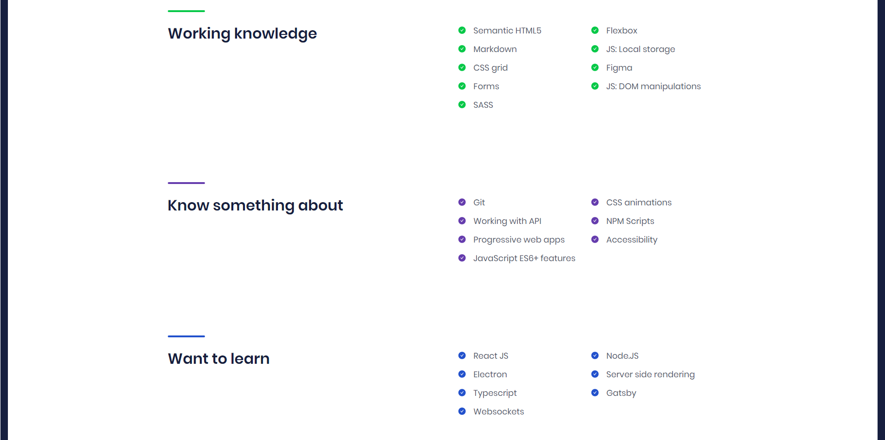

# Rafał Mróz personal portfolio website
My personal website done while 'WTF- co ten frontend' course.
## Tools and technologies:
- Visual Studio Code
- CSS Grid
- **SASS**
- HTML 5
- BEM
- JS
- **Fetch API**
- CSS Flexbox
- Markdown (to make this description)
- Wtf starter kit
- Npm script (to deploy site to github pages)
- **Git**
- Figma
- and more
